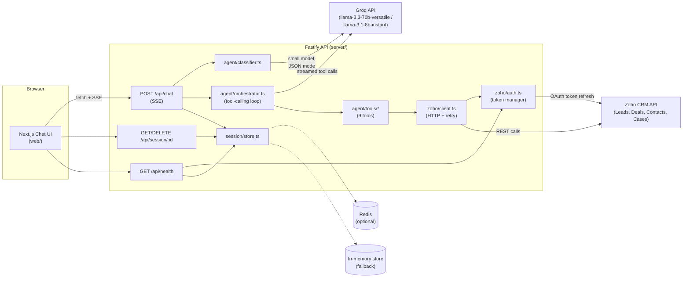
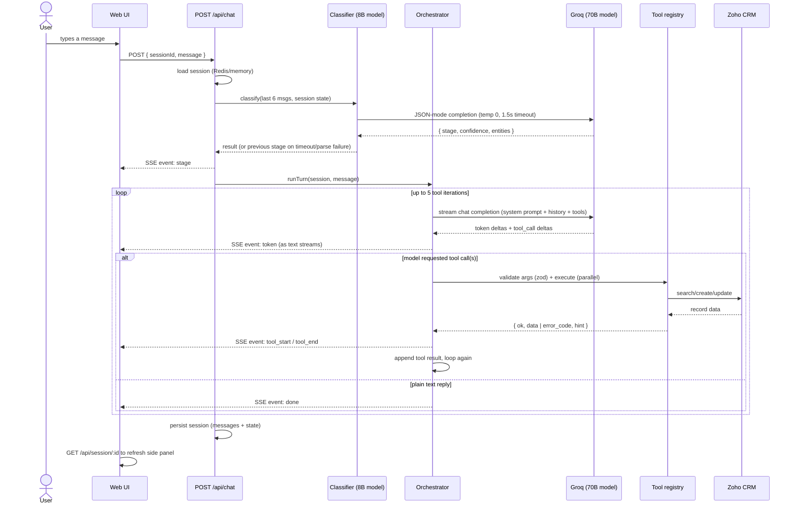
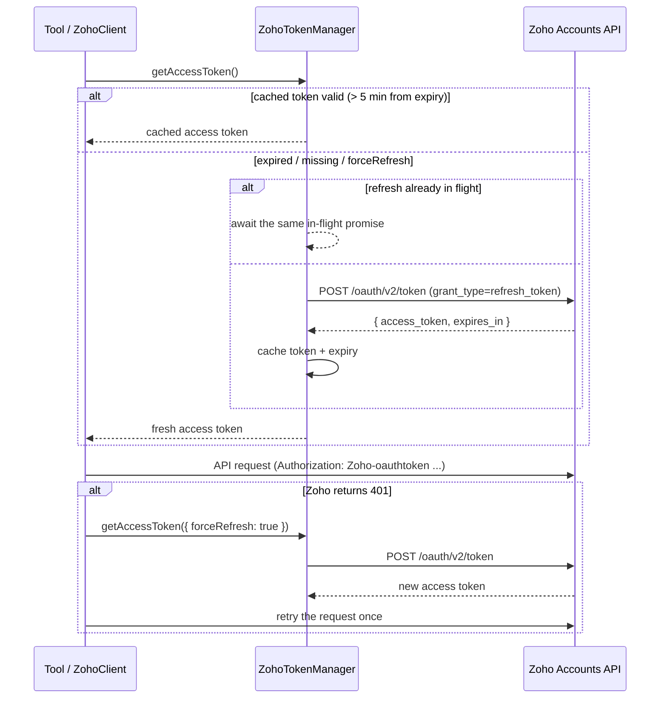

# Architecture

## 1. System components

`LLMProvider` (`server/src/llm/provider.ts`) is a small interface; `GroqProvider`
is the only implementation today, but a `GeminiProvider` could be dropped in
without touching the classifier or orchestrator.

## 2. Per-turn sequence

## 3. Zoho OAuth token refresh flow

Key properties: proactive refresh 5 minutes before expiry, single-flight
de-duplication of concurrent refreshes (Zoho rate-limits refresh calls), and
exactly one forced retry on a 401 — never an unbounded loop.
